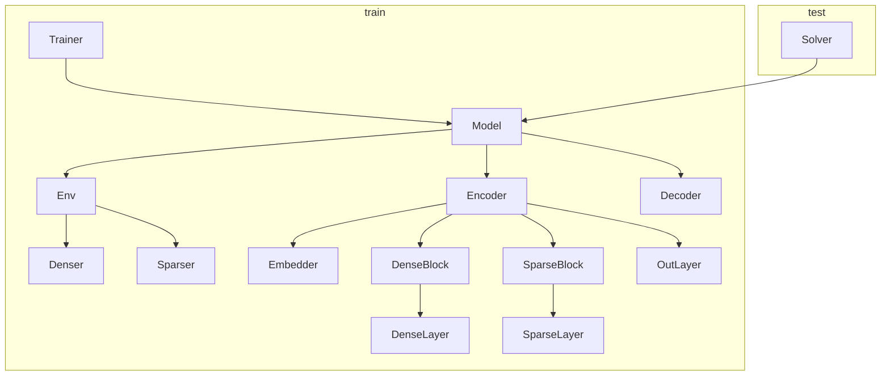

本文将精读 GNN4CO 代码，代码来自 RethinkLab 的 ML4CO-Bench-101 仓库，具体代码见 [https://github.com/Thinklab-SJTU/ML4CO-Bench-101/tree/main/ml4co/gnn4co](https://github.com/Thinklab-SJTU/ML4CO-Bench-101/tree/main/ml4co/gnn4co)。

<!-- more -->

## 引言

为了更好地进行 ML4CO 方向的研究，我们应该熟悉 ML4CO 的具体代码，**能看懂代码逻辑和实现方法**，并按照自己的需求进行修改。[ML4CO-Bench-101](https://github.com/Thinklab-SJTU/ML4CO-Bench-101) 是 Rethinklab 的一个 github 仓库，其中整合了诸多经典的 ML4CO 方法的代码实现。**我们将以 ML4CO-Bench-101 中的代码作为分析的素材。**

一般来说，一个大项目的代码都会比较庞大，一句句理解非常困难。我们将**遵循从宏观到微观的阅读方法**，先了解每块代码的作用，再针对性分析重点的语句。

## 整体框架

```plaintext
.
├── __init__.py
├── env
│   ├── __init__.py
│   ├── dense
│   │   ├── __init__.py
│   │   ├── atsp.py
│   │   ├── cvrp.py
│   │   └── tsp.py
│   ├── denser.py
│   ├── env.py
│   ├── sparse
│   │   ├── __init__.py
│   │   ├── atsp.py
│   │   ├── cvrp.py
│   │   ├── mcl.py
│   │   ├── mcut.py
│   │   ├── mis.py
│   │   ├── mvc.py
│   │   └── tsp.py
│   └── sparser.py
├── model
│   ├── __init__.py
│   ├── decoder
│   │   ├── __init__.py
│   │   ├── atsp.py
│   │   ├── base.py
│   │   ├── mcl.py
│   │   ├── mcut.py
│   │   ├── mis.py
│   │   ├── mvc.py
│   │   └── tsp.py
│   ├── embedder
│   │   ├── __init__.py
│   │   ├── atsp.py
│   │   ├── base.py
│   │   ├── cvrp.py
│   │   ├── mcl.py
│   │   ├── mcut.py
│   │   ├── mis.py
│   │   ├── mvc.py
│   │   ├── tsp.py
│   │   └── utils.py
│   ├── encoder
│   │   ├── __init__.py
│   │   ├── gnn_encoder.py
│   │   ├── gnn_encoder_tsp.py
│   │   ├── gnn_layer.py
│   │   └── gnn_layer_tsp.py
│   ├── model.py
│   └── out_layer
│       ├── __init__.py
│       ├── base.py
│       ├── edge.py
│       ├── node.py
│       └── utils.py
└── solver
    ├── __init__.py
    ├── atsp.py
    ├── mcl.py
    ├── mcut.py
    ├── mis.py
    ├── mvc.py
    └── tsp.py
```

可以看到，GNN4CO 的代码整体分为 `env`、`model` 和 `solver` 三部分。这三部分各自的功能是：
- `env`：负责数据集的生成和加载。
- `model`：核心模型，包含 `Encoder` 和 `Decoder`，并需要 `Env` 来生成训练和验证数据。
- `solver`：求解器，用于 test 阶段，会调用训练好的 `Model` 进行测试。



这是代码中关键的 class 之间的调用关系。**训练时**，我们调用 Pytorch Lightning 库中的 `Trainer` 来训练 `Model`；**测试时**，我们调用 `Solver` 来对 `Model` 进行测试。

需要说明的是，**sparse 和 dense 分别表示图的稀疏表示和稠密表示**。在稀疏表示中，我们保存每条边连接的两个顶点编号，即图的边表表示；在稠密表示中，我们记录每一对顶点之间是否有边，即图的邻接矩阵表示。

## Env

`Env` 为训练、验证和测试提供数据，主要包括了**数据的读取与解析、数据的格式转换、数据的批供给**等功能。核心的类是 `GNN4COEnv`，它从文件中读取各种 CO 问题的原始数据，将其转换为适应 GNN 的格式（支持稠密图和稀疏图），为模型的训练、验证和测试提供一批批处理好的数据。

### `env.py`

`env.py` 中首先定义了一个 `FakeDataset`。

```python
class FakeDataset(Dataset):
    def __init__(self, data_size: int):
        self.data_size = data_size

    def __len__(self):
        return self.data_size
    
    def __getitem__(self, idx: int):
        return torch.tensor([idx])
```

这是一个辅助性的**伪数据集**，本身不包含任何真实数据，只实现了最基本的方法。这里定义的 `FakeDataset` 会被放入 `train_dataloader`、`val_dataloader` 和 `test_dataloader`。Pytorch Lightning 框架会自动将数据做成 batch，传递给 `Model` 的训练、验证和测试函数。但这里，我们并不实际用这个数据的传递路径，而是直接在 `Model` 中通过调用 `Env` 提供的方法来加载数据。原因是可以更加灵活，按照需要读取数据，不用一次性读入。

接下来，我们看核心的 `GNN4COEnv` 类。

```python
class GNN4COEnv(BaseEnv):
    def __init__(
        self,
        task: str = None,  # "TSP", "MIS", etc.
        mode: str = None,  # "train", "val", "solve"
        train_data_size: int = 128000,
        val_data_size: int = 128,
        train_batch_size: int = 4,
        val_batch_size: int = 4,
        num_workers: int = 4,
        sparse_factor: int = 50,
        device: str = "cpu",
        train_folder: str = None,
        val_path: str = None,
        store_data: bool = True,
    ):
        super().__init__(
            name="GNN4COEnv",
            mode=mode,
            train_batch_size=train_batch_size,
            val_batch_size=val_batch_size,
            num_workers=num_workers,
            device=device
        )
        
        # basic
        self.task = task
        self.sparse = sparse_factor > 0
        self.sparse_factor = sparse_factor
        
        # train data folder and val path
        self.train_folder = train_folder
        self.val_path = val_path
        
        # ml4co-kit solver
        self.atsp_solver = ATSPSolver()
        self.cvrp_solver = CVRPSolver()
        self.mcl_solver = MClSolver()
        self.mcut_solver = MCutSolver()
        self.mis_solver = MISSolver()
        self.mvc_solver = MVCSolver()
        self.tsp_solver = TSPSolver()
        
        # dataset (Fake)
        self.store_data = store_data
        self.train_dataset = FakeDataset(train_data_size)
        self.val_dataset = FakeDataset(val_data_size)
          
        # data_processor (sparser and denser)
        if self.sparse:
            self.data_processor = GNN4COSparser(self.sparse_factor, self.device)
        else:
            self.data_processor = GNN4CODenser(self.device)
        
        # load data
        if self.mode is not None:
            self.load_data()
```

主要看几个初始化参数：
- `train_data_size` 和 `val_data_size`：训练和验证数据集的名义大小，仅用于创建 `FakeDataset`。
- `num_workers`：PyTorch `DataLoader` 使用的子进程数量，用于并行加载数据。
- `sparse_factor`：决定数据处理方式，如果 $> 0$，则启用稀疏图模式；否则，使用稠密图模式。具体含义见后文。
- `train_folder`：包含多个训练数据文件的文件夹路径，训练模式必需。
- `val_path`：单个验证数据文件的路径，验证模式必需。
- `store_data`：是否在内存中缓存已加载的训练文件，以加速后续 epoch 的数据读取。具体后文介绍。

```python
	def load_data(self):
        if self.mode == "train":
            self.train_sub_files = [
                os.path.join(self.train_folder, train_files) \
                    for train_files in os.listdir(self.train_folder) 
            ]
            self.train_sub_files_num = len(self.train_sub_files)
            self.train_data_historty_cache = dict()
            self.train_data_cache = None
            self.val_data_cache = None
            self.train_data_cache_idx = 0
        else:
            pass
```

`load_data()` 方法只有在训练模式下使用，**为数据加载做准备工作**。首先，扫描 `self.train_folder` 目录，获取所有训练数据文件的路径列表 `self.train_sub_files`。接着，初始化用于训练数据缓存的字典和变量，如 `self.train_data_historty_cache`（历史缓存，用于存储已加载过的整个文件）和 `self.train_data_cache`（当前缓存，存放当前正在使用的文件数据）。

```python
	def train_dataloader(self):
        train_dataloader=DataLoader(
            self.train_dataset, 
            batch_size=self.train_batch_size, 
            shuffle=True,
            num_workers=self.num_workers, 
            pin_memory=True,
            persistent_workers=True, 
            drop_last=True
        )
        return train_dataloader
```
（此处省略类似的 `val_dataloader()` 和 `test_dataloader()` 方法）

`train_dataloader()`、`val_dataloader()` 和 `test_dataloader()` 方法被 PyTorch Lightning 调用，返回 `Dataloader` 对象。但注意，这个返回的 `Dataloader` 是 fake 的，其中只有索引而没有真实数据。

```python
	def generate_val_data(self, val_idx: int) -> Any:
        begin_idx = val_idx * self.val_batch_size
        end_idx = begin_idx + self.val_batch_size
        if self.task == "ATSP":
            return self.generate_val_data_atsp(begin_idx, end_idx)
        elif self.task == "CVRP":
            return self.generate_val_data_cvrp(begin_idx, end_idx)
        elif self.task == "MCl":
            return self.generate_val_data_mcl(begin_idx, end_idx)
        elif self.task == "MCut":
            return self.generate_val_data_mcut(begin_idx, end_idx)
        elif self.task == "MIS":
            return self.generate_val_data_mis(begin_idx, end_idx)
        elif self.task == "MVC":
            return self.generate_val_data_mvc(begin_idx, end_idx)
        elif self.task == "TSP":
            return self.generate_val_data_tsp(begin_idx, end_idx) 
```

`generate_val_data()` 方法是分发器，根据 `self.task` 调用具体的生成函数，这些生成函数就是真实产生数据的地方。`val_idx` 是批次序号，即需要第几批数据。根据这个序号及 `self.batch_size` 即可推算出这个批次的 `begin_idx` 和 `end_idx`。

```python
	def generate_val_data_tsp(self, begin_idx: int, end_idx: int) -> Any:
        if self.val_data_cache is None:
            self.tsp_solver.from_txt(self.val_path, ref=True)
            self.val_data_cache = {
                "points": self.tsp_solver.points,
                "ref_tours": self.tsp_solver.ref_tours
            }
        return self.data_processor.tsp_batch_data_process(
            points=self.val_data_cache["points"][begin_idx:end_idx], 
            ref_tours=self.val_data_cache["ref_tours"][begin_idx:end_idx]
        )
```
（此处省略 `generate_val_data_atsp` 等其他任务的类似函数）

接下来是一组 `generate_val_data_...()` 方法，作用是**生成并处理一个批次的验证数据**。这里以 `generate_val_data_tsp()` 为例。首先，检查 `self.val_data_cache` 是否为空。

- **如果为空**：表明是第一次调用，它会调用 `self.tsp_solver` 的 `from_txt()` 方法，**一次性将整个验证文件中的数据加载到内存中**，并存入 `self.val_data_cache`。
- **如果不为空**：表示已经加载过数据，于是直接从内存中的 `self.val_data_cache` 根据 `begin_idx` 和 `end_idx` 切片出当前批次所需的数据。

最后，将切片出的数据交给 `self.data_processor` 进行最终的格式转换，然后返回。格式转换的具体做法见后文。

其他 `generate_val_data_...()` 函数逻辑完全相同，只是调用的 solver 和 processor 方法不同。

```python
	def generate_train_data(self, batch_size: int) -> Any:
        if self.task == "ATSP":
            return self.generate_train_data_atsp(batch_size)
        elif self.task == "CVRP":
            return self.generate_train_data_cvrp(batch_size)
        elif self.task == "MCl":
            return self.generate_train_data_mcl(batch_size)
        elif self.task == "MCut":
            return self.generate_train_data_mcut(batch_size)
        elif self.task == "MIS":
            return self.generate_train_data_mis(batch_size)
        elif self.task == "MVC":
            return self.generate_train_data_mvc(batch_size)
        elif self.task == "TSP":
            return self.generate_train_data_tsp(batch_size) 
```

`generate_train_data()` 与 `generate_val_data()` 类似，但不计算 `begin_idx` 和 `end_idx`，具体在各个任务的方法中实现。

```python
	def generate_train_data_tsp(self, batch_size: int) -> Any:
        # check data cache
        begin_idx = self.train_data_cache_idx
        end_idx = begin_idx + batch_size
        if self.train_data_cache is None or end_idx > self.train_data_cache["data_size"]:
            # select one train file randomly
            sel_idx = np.random.randint(low=0, high=self.train_sub_files_num, size=(1,))[0]
            sel_train_sub_file_path = self.train_sub_files[sel_idx]

            # check if the data is in the cache when store_data is True
            if self.store_data and sel_train_sub_file_path in self.train_data_historty_cache.keys():
                # using data cache if the data is in the cache
                print(f"\nusing data cache ({sel_train_sub_file_path})")
                self.train_data_cache = self.train_data_historty_cache[sel_train_sub_file_path]
            else: 
                # load data from the train file
                print(f"\nload tsp train data from {sel_train_sub_file_path}")
                self.tsp_solver.from_txt(sel_train_sub_file_path, show_time=True, ref=True)
                self.train_data_cache = {
                    "points": self.tsp_solver.points,
                    "ref_tours": self.tsp_solver.ref_tours,
                    "data_size": self.tsp_solver.points.shape[0]
                }
                if self.store_data:
                    self.train_data_historty_cache[sel_train_sub_file_path] = self.train_data_cache
            
            # update cache and index
            self.train_data_cache_idx = 0
            begin_idx = self.train_data_cache_idx
            end_idx = begin_idx + batch_size
    
        # retrieve a portion of data from the cache
        points = self.train_data_cache["points"][begin_idx:end_idx]
        ref_tours = self.train_data_cache["ref_tours"][begin_idx:end_idx]
        self.train_data_cache_idx = end_idx
            
        # data process
        return self.data_processor.tsp_batch_data_process(points, ref_tours)
```
（此处省略 `generate_train_data_atsp` 等其他问题的类似函数）

接下来是一组 `generate_train_data_...()` 方法，作用是**生成并处理一个批次的训练数据**。`self.train_data_cache_idx` 中保存了下一条数据在 `self.train_data_cache` 中的序号，再由 `batch_size` 我们可以计算出这个批次的 `begin_idx` 和 `end_idx`。
- 首先，检查 `self。train_data_cache` 中剩余的数据是否足够供应当前的 `batch_size`。
- 如果缓存不足（`end_idx > self.train_data_cache["data_size"]`）或者根本还没有缓存（`self.train_data_cache is None`），那么：
  - 先从 `self.train_sub_files` 列表中随机挑选一个训练文件 `sel_train_sub_file_path`。
  - 如果 `self.store_data` 是否为 `True`，即加载过的数据会被保存，那么继续检查这个随机选中的文件是否已经存在于 `self.train_data_historty_cache` 中。
  - 如果存在，**直接从内存中读取，避免了磁盘 I/O，提升了速度**。
  - 如果不存在，就只能从磁盘文件中加载。加载后，如果 `self.store_data` 为 `True`，会将其存入历史缓存中，供未来使用。
  - 加载完新文件后，将 `self.train_data_cache_idx` 重置为 0。
- 确认需要的数据已经在内存中后，从当前文件缓存 `self.train_data_cache` 中切片出当前批次的数据。接着，更新 `self.train_data_cache_idx`，指向下一批数据的起始位置。
- 最后，将切片出的数据交给 `self.data_processor` 处理后返回。

### `denser.py`

`GNN4CODenser` 类是一个**批处理转换器**，接收一个批次 Numpy 格式的原始数据，并将它们转换成一个批次 PyTorch Tensor 格式的、适用于 GNN 模型的稠密图表示。稠密，即用**邻接矩阵或距离矩阵**来表示图的结构。在矩阵中，每个节点都与其他所有节点有一条边，矩阵的每个元素 `(i, j)` 代表了节点 `i` 和 `j` 之间的关系（如距离）。

```python
class GNN4CODenser(object):
    def __init__(self, device: str) -> None:
        self.device = device
```

构造函数，保存 device 属性。后续所有生成的 PyTorch Tensor 都将被移动到这个指定的设备上，以确保数据和模型在同一个设备上。

```python
	def initial_lists(self):
        self.nodes_feature_list = list()
        self.x_list = list()
        self.graph_list = list()
        self.ground_truth_list = list()
        self.nodes_num_list = list()
        
    def update_lists(self, dense_data: Any):
        self.x_list.append(dense_data[0])
        self.graph_list.append(dense_data[1])
        self.ground_truth_list.append(dense_data[2])
        self.nodes_num_list.append(dense_data[3])
```

这是一对状态管理的辅助函数。`initial_lists()` 方法在处理一个新批次的最开始被调用，负责清空所有用于临时存储的列表。`update_lists()` 方法在循环中被反复调用，将每个处理好的数据实例（一个包含节点特征、图矩阵、真值等的元组）的各个部分分别追加到对应的列表中。

```python
	def edge_merge_process(self, task: str, with_gt: bool) -> Any:
        # nodes feature
        if self.x_list[0] is not None:
            x = torch.stack(self.x_list, 0).to(self.device)
        else:
            x = None
            
        # graph
        graph = torch.stack(self.graph_list, 0).to(self.device)

        # ground truth
        if with_gt:
            ground_truth = torch.stack(
                self.ground_truth_list, 0
            ).to(self.device) # (B, V, V) or (B, V)
        else:
            ground_truth = None
        
        return (task, x, graph, ground_truth, self.nodes_num_list) 
```

`edge_merge_process()` 方法负责将收集到的数据列表打包成最终的批次化输出。
- 节点特征 `x`：使用 `torch.stack(self.x_list, 0)` 将多个 `(V, D)` 形状的节点特征 Tensor 堆叠成一个 `(B, V, D)` 的批次张量（其中 `B` 是批大小，`V` 是节点数，`D` 是特征维度）。
- 图 `graph`：将多个 `(V, V)` 的邻接矩阵或距离矩阵堆叠成 `(B, V, V)` 的批次张量。
- 真值 `ground_truth`：如果 `with_gt` 为 `True`，则将真值（如最优路径）也堆叠成批次张量。

所有创建的 Tensor 都被 `.to(self.device)` 移动到目标设备。最后，将所有处理好的数据打包成一个元组返回。**这个元组就是 GNN 模型的最终输入。**

```python
	def tsp_batch_data_process(
        self, points: np.ndarray, ref_tours: np.ndarray, sampling_num: int = 1
    ) -> Any:
        # check dimension
        check_dim(points, 3)
        check_dim(ref_tours, 2)
        
        # initialize lists
        self.initial_lists()
        
        # dense process
        for idx in range(points.shape[0]):
            dense_data = tsp_dense_process(
                points=points[idx], 
                ref_tour=ref_tours[idx] if ref_tours is not None else None, 
            )
            for _ in range(sampling_num):
                self.update_lists(dense_data)
        
        # merge
        return self.edge_merge_process(
            task="TSP", 
            with_gt=True if ref_tours is not None else False
        )
```
（此处省略 `atsp_batch_data_process` 等其他问题的类似函数）

注意，**只有选边问题（ATSP、CVRP、TSP）进行了稠密图实现**，选点问题没有稠密图实现。这一系列函数是**供外部调用的数据处理核心函数**。

我们此处以 TSP 的对应方法为例。首先，检查输入维度，并调用 `initial_lists()` 方法重置状态。接着，遍历批次中的每一个问题实例，通过调用了 `tsp_dense_process()` 方法来处理单个 TSP 实例，并将单个实例的处理结果存入列表中。如果 `sampling_num` 大于 1，同一个处理好的实例会被重复添加到列表中多次，用于数据增强。最后，调用 `edge_merge_process()` 完成最后的打包工作，并返回结果。

### `dense`

我们接着看**单个实例的格式转换**。这些函数位于 `dense` 文件夹中，用于接收单个实例的 Numpy 格式的原始数据，并将其转换成 PyTorch Tensor 格式的、适用于 GNN 模型的**稠密图**表示。此处还是以 TSP 为例。

#### `tsp.py`

```python
def tsp_dense_process(points: np.ndarray, ref_tour: np.ndarray):
    # check dimension
    check_dim(points, 2)
    check_dim(ref_tour, 1)

    # nodes_num
    nodes_num = points.shape[0]
    
    # x and graph
    x = to_tensor(points)
    graph = to_tensor(cdist(points, points)).float()
    
    # ground truth
    if ref_tour is not None:
        ground_truth = torch.zeros(size=(nodes_num, nodes_num))
        for idx in range(len(ref_tour) - 1):
            ground_truth[ref_tour[idx]][ref_tour[idx+1]] = 1
        ground_truth = ground_truth + ground_truth.T
    else:
        ground_truth = None

    return (
        x, # (V, 2): nodes feature, random init
        graph.float(), # (V, V): edges feature, distance matrix
        ground_truth.long(), # (V,): Ground truth
        nodes_num, # Number of nodes
    )
```

`points` 的形状为 `(V, 2)`，是每个城市的二维坐标；`ref_tour` 的形状为 `(V+1,)`，表示参考路径。首先，检查输入维度，并提取节点数量。`x = to_tensor(points)` 直接使用节点的坐标作为其特征，转换为 Pytorch Tensor 格式。`graph = to_tensor(cdist(points, points)).float()` 计算距离矩阵并转换为 Tensor。接着，构建 `ground_truth`：遍历 `ref_tour` 序列，将其中的每一步在邻接矩阵中标记为 1，其余为 0，并通过 `ground_truth = ground_truth + ground_truth.T` 转换为无向图。最终，将所有处理好的数据打包成一个元组返回。

### `sparser.py`

与 `GNN4CODenser` 类似，`GNN4COSparser` 的作用时：接收一个批次 Numpy 格式的原始数据，并将它们转换成单个巨大的、由多个不相连子图组成的、PyTorch Tensor 格式的、适用于 GNN 模型的**稀疏图**表示。

稀疏图采用 **COO (Coordinate Format)**，用 `edge_index` 和 `edge_features` 表示图。`edge_index` 是一个形状为 `(2, E)` 的 Tensor，其中 `E` 是图中边的总数。第一行是所有边的源节点索引，第二行是对应的目标节点索引。`edge_features` 是一个形状为 `(E, D_e)` 的 Tensor，存储每条边的特征（如边的权重或距离）。对于节点很多但连接相对较少的图，稀疏表示法在内存占用和计算效率上远超稠密表示法。

```python
class GNN4COSparser(object):
    def __init__(self, sparse_factor: int, device: str) -> None:
        self.sparse_factor = sparse_factor
        self.device = device
```

初始化部分，关注一下 **`sparse_factor` 参数**，用来控制稀疏化的程度。通常代表 k-Nearest Neighbors (k-NN) 中的 k。即对于每个节点，只保留到它最近的 k 个邻居的边，从而将一个完全图稀疏化。但是注意，**这只对选边问题有效**。选点问题默认采用稀疏图，且 `sparse_factor` 不起作用，即我们不会丢弃任何边。

```python
	def initial_lists(self):
        self.x_list = list()
        self.e_list = list()
        self.edge_index_list = list()
        self.graph_list = list()
        self.ground_truth_list = list()
        self.nodes_num_list = list()
        self.edges_num_list = list()
        
    def update_lists(self, sparse_data: Any):
        self.x_list.append(sparse_data[0])
        self.e_list.append(sparse_data[1])
        self.edge_index_list.append(sparse_data[2])
        self.graph_list.append(sparse_data[3])
        self.ground_truth_list.append(sparse_data[4])
        self.nodes_num_list.append(sparse_data[5])
        self.edges_num_list.append(sparse_data[6])
```

与 `GNN4CODenser` 中的方法类似，此处略过。

```python
	def merge_process(self, task: str, with_gt: bool) -> Any:
        # nodes feature
        if self.x_list[0] is not None:
            x = torch.cat(self.x_list, 0).to(self.device) # (V, C) or (V,)
        else:
            x = None
            
        # edges feature
        if self.e_list[0] is not None:
            e = torch.cat(self.e_list, 0).to(self.device) # (V, C) or (E,)
        else:
            e = None

        # edge index
        add_index = 0
        edge_index_list = list()
        for idx, edge_index in enumerate(self.edge_index_list):
            edge_index_list.append(edge_index + add_index)
            add_index += self.nodes_num_list[idx]
        edge_index = torch.cat(edge_index_list, 1).to(self.device) # (2, E)

        # ground truth
        if with_gt:
            ground_truth = torch.cat(self.ground_truth_list, 0).to(self.device) # (E,) or (V,)
        else:
            ground_truth = None
            
        return (
            task, x, e, edge_index, self.graph_list, 
            ground_truth, self.nodes_num_list, self.edges_num_list
        )
```

`merge_process()` 方法用于**实现稀疏图的批处理合并**。注意，这里**合并逻辑和稠密图不同**。在主流 GNN 框架中，批处理稀疏图的标准做法不是将它们堆叠成一个 `(B, ...)` 的张量，而是将它们**拼接成一个包含了所有子图的“巨图”（Giant Graph）**。

首先，处理节点特征 `x` 和边特征 `e`。与之前使用的 `stack` 不同，这里是用的是 `cat`，即**在原有维度上进行拼接**。这两个函数的区别我们在 [Fancy but Useful Tensor Operations](https://cny123222.github.io/2025/08/14/Fancy-but-Useful-Tensor-Operations/) 中介绍过。`cat()` 将所有图的所有节点特征和所有边特征分别拼接成一个长列表。

接着，处理边索引 `edge_index`。如果直接拼接 `edge_index`，所有图的节点索引都会从 0 开始，这会导致混淆。第二个图中的节点 0 会和第一个图中的节点 0 无法区分。因此，采用**偏移索引**的方法。例如，假设每个 TSP 实例都有 50 个节点，那么第一个图的节点编号为 0 到 49，第二个图的节点编号为 50 到 99，以此类推。对每个图的 `edge_index`，加上 `add_index` 这一偏移量，更新 `add_index`，最后在 `dim=1` 上拼接，形成形状为 `(2, total_E)` 的 Tensor。

`ground_truth` 的处理逻辑与节点和边特征相同。最终，返回一个包含 8 个元素的元组，这是一个完整的、批处理过的稀疏图表示。

```python
	def tsp_batch_data_process(
        self, points: np.ndarray, ref_tours: np.ndarray, sampling_num: int = 1
    ) -> Any:
        # check dimension
        check_dim(points, 3)
        check_dim(ref_tours, 2)
        
        # initialize lists
        self.initial_lists()
        
        # sparse process
        for idx in range(points.shape[0]):
            sparse_data = tsp_sparse_process(
                points=points[idx], 
                ref_tour=ref_tours[idx] if ref_tours  is not None else None, 
                sparse_factor=self.sparse_factor
            )
            for _ in range(sampling_num):
                self.update_lists(sparse_data)
        
        # merge
        return self.merge_process(
            task="TSP", 
            with_gt=True if ref_tours is not None else False
        )
```
（此处省略 `atsp_batch_data_process` 等类似函数）

`..._batch_data_process()` 是一系列类似的方法，是外部调用的接口。其内部逻辑与 `GNN4CODenser` 中的版本几乎完全相同，但**支持选边和选点的所有问题**。

### `sparse`

接着看稀疏图中**单个实例的格式转换**。这些函数位于 `sparse` 文件夹中，用于接收单个实例的 Numpy 格式的原始数据，通过 KNN 算法对其进行稀疏化，然后将其转换成 GNN 模型可以处理的稀疏图格式（节点特征、边特征、边索引和真值）。此处仍然以 TSP 为例。

#### `tsp.py`

```python
import torch
import numpy as np
import torch.utils.data
from torch import Tensor
from typing import Sequence
from sklearn.neighbors import KDTree
from ml4co_kit import check_dim, to_tensor


def tsp_sparse_process(
    points: np.ndarray, ref_tour: np.ndarray, sparse_factor: int
) -> Sequence[Tensor]:
    # check dimension
    check_dim(points, 2)
    check_dim(ref_tour, 1)

    # nodes_num and edges_num
    nodes_num = points.shape[0]
    edges_num = nodes_num * sparse_factor
    
    # KDTree        
    kdt = KDTree(points, leaf_size=30, metric='euclidean')
    dists_knn, idx_knn = kdt.query(points, k=sparse_factor, return_distance=True)
    e = to_tensor(dists_knn.reshape(-1))
    
    # edge_index
    edge_index_0 = torch.arange(nodes_num).reshape((-1, 1))
    edge_index_0 = edge_index_0.repeat(1, sparse_factor).reshape(-1)
    edge_index_1 = torch.from_numpy(idx_knn.reshape(-1))
    edge_index = torch.stack([edge_index_0, edge_index_1], dim=0)
    
    # ground truth
    if ref_tour is not None:
        tour_edges = np.zeros(nodes_num, dtype=np.int64)
        tour_edges[ref_tour[:-1]] = ref_tour[1:]
        tour_edges = torch.from_numpy(tour_edges)
        tour_edges = tour_edges.reshape((-1, 1)).repeat(1, sparse_factor).reshape(-1)
        tour_edges = torch.eq(edge_index_1, tour_edges).reshape(-1, 1)
        
        tour_edges_rv = np.zeros(nodes_num, dtype=np.int64)
        tour_edges_rv[ref_tour[1:]] = ref_tour[0:-1]
        tour_edges_rv = torch.from_numpy(tour_edges_rv)
        tour_edges_rv = tour_edges_rv.reshape((-1, 1)).repeat(1, sparse_factor).reshape(-1)
        tour_edges_rv = torch.eq(edge_index_1, tour_edges_rv).reshape(-1, 1)
        ground_truth = (tour_edges + tour_edges_rv).reshape(-1).long()
    else:
        ground_truth = None
    
    # nodes feature
    x = to_tensor(points)
    
    return (
        x.float(), # (V, 2): nodes feature, Euler coordinates of nodes
        e.float(), # (E,): edges feature, distance between nodes
        edge_index.long(), # (2, E): Index of edge endpoints
        None, # (V, V): Graph, but no need for TSP when sparse
        ground_truth, # (V,): Ground truth
        nodes_num, # Number of nodes
        edges_num # Number of edges
    )
```

首先，检查输入维度，并计算节点和边的数量。

接着，**构建 KD 树**，这是一种专门用于在高维空间中进行快速最近邻搜索的数据结构。对 `points` 数组中的每一个点，在 KD 树中查询离它最近的 `sparse_factor` 个点。返回的 `idx_knn` 形状为 `(V, sparse_factor)`，`idx_knn[i][j]` 是节点 `i` 的第 `j` 个最近邻的索引；`dists_knn` 形状也为 `(V, sparse_factor)`，`dists_knn[i][j]` 是节点 `i` 与其第 `j` 个最近邻之间的距离。`e = to_tensor(dists_knn.reshape(-1))` 将距离矩阵展平为一维数组，再转换为 Tensor，形状为 `(edges_num,)`。

然后，构建边索引 `edge_index`，形状为 `(2, E)`，对应 `e` 中每条边的源节点和目标节点。我们逐句分析一下：

```python
edge_index_0 = torch.arange(nodes_num).reshape((-1, 1))
```
创建了 `[0, 1, 2, ..., V-1]`，并将其形状变为 `(V, 1)`。

```python
edge_index_0 = edge_index_0.repeat(1, sparse_factor).reshape(-1)
```
每行重复 `sparse_factor` 次，将其变成 `[[0, 0, ...], [1, 1, ...], ...]` 的形式，再展平成 `[0, 0, ..., 1, 1, ..., V-1, V-1, ...]`。这完美地构造了所有边的**源节点列表**。

```python
edge_index_1 = torch.from_numpy(idx_knn.reshape(-1))
```
直接将 `idx_knn` (最近邻索引矩阵) 展平并转换为 Tensor。这自然地构成了所有边的**目标节点列表**。

最终，将源节点列表和目标节点列表堆叠起来，形成 `(2, E)` 的 `edge_index`。

接着，构建真值 `ground_truth`，为稀疏图中的每一条边打上标签（1 代表属于最优路径，0 代表不属于）。首先构建正向路径 `tour_edges`，还是一句句看。

```python
tour_edges[ref_tour[:-1]] = ref_tour[1:]
```
这句使用高级索引，创建了一个映射。如果 `ref_tour` 是 `[0, 2, 1, 3, 0]`，那么 `tour_edges` 就会变成 `[2, 3, 1, 0]`。`tour_edges[i]` 表示在最优路径中，节点 `i` 的下一个节点的序号。

```python
tour_edges = tour_edges.reshape((-1, 1)).repeat(1, sparse_factor).reshape(-1)
```
与之前 `edge_index` 中操作类似，这步将这个映射扩展成形状 `(E,)`。现在，对于源节点 `i` 的所有 `sparse_factor` 条出边，它们对应的 `tour_edges` 值都是 `i` 在最优路径中的下一个节点。

```python
tour_edges = torch.eq(edge_index_1, tour_edges).reshape(-1, 1)
```
逐元素地比较 `edge_index_1` (真实的目标节点) 和 `tour_edges` (期望的目标节点)。只有当一条边的真实目标节点恰好是源节点在最优路径中的下一个节点时，结果才为 `True`。

接着，构建反向路径 `tour_edges_rv`，即反过来走 `ref_tour` 中的路线。这是为了将 TSP 的无向路径考虑进来。最终，将正向和反向的结果相加。一条边只要在正向或反向路径中出现，它的标签就会是 1。得到的 `ground_truth` 是一个形状为 `(E,)` 的一维 Tensor，对应了稀疏图中的每一条边。

最后，使用坐标作为节点特征，并打包返回。注意，TSP 不再需要图信息，故元组的第 4 个元素为 `None`。

## Solver

`Solver` 中封装了各个问题的求解器，供测试阶段调用。此处我们以 TSP 的 solver 为例。

测试脚本如下：
```python
if __name__ == "__main__":
    solver = GNN4COTSPSolver(
        model=GNN4COModel(
            env=GNN4COEnv(
                task="TSP", sparse_factor=SPARSE_FACTOR, device="cuda"
            ),
            encoder=TSPGNNEncoder(sparse=SPARSE_FACTOR>0),
            decoder=TSPDecoder(
                decoding_type=SOLVING_SETTINGS[0], 
                local_search_type=SOLVING_SETTINGS[1],
                mcts_time_limit=MCTS_TIME_LIMIT,
                mcts_type_2opt=MCTS_TYPE_FLAG
            ),
            weight_path=WEIGHT_PATH_DICT[NODES_NUM]
        )
    )
    solver.from_txt(TEST_FILE_DICT[NODES_NUM], ref=True, show_time=True)
    solver.solve(show_time=True)
    print(solver.evaluate(calculate_gap=True))
```

### `tsp.py`

这个 `GNN4COTSPSolver` 继承自 `ml4co_kit` 中的 `TSPSolver`，重载了其中的 `solve()` 方法。

```python
class GNN4COTSPSolver(TSPSolver):
    def __init__(self, model: GNN4COModel, seed: int = 1234):
        super(GNN4COTSPSolver, self).__init__(solver_type=SOLVER_TYPE.ML4TSP)
        self.model: GNN4COModel = model
        self.model.eval()
        self.model.env.mode = "solve"
        torch.manual_seed(seed=seed)
```

初始化阶段，注意 `torch.manual_seed(seed=seed)` 这一步，是在设置随机种子，**以保证任何可能存在的随机性（如解码阶段的采样）都是可复现的**。

```python
    def solve(
        self, batch_size: int = 1, sampling_num: int = 1, show_time: bool = False
    ):
        # timer
        timer = Timer(apply=show_time)
        timer.start()
        
        # solve
        msg = f"Solving solutions using GNN4COTSPSolver"
        samples_num = len(self.points)
        solutions_list = list()
        self._normalize_points()
        for idx in iterative_execution(range, samples_num // batch_size, msg, show_time):
            # begin index and end index
            begin_idx = idx * batch_size
            end_idx = begin_idx + batch_size
            
            # data processor
            data = self.model.env.data_processor.tsp_batch_data_process(
                points=self.points[begin_idx:end_idx], 
                ref_tours=self.ref_tours[begin_idx:end_idx], 
                sampling_num=sampling_num
            )

            # inference to get heatmap and decoding
            if self.model.env.sparse:
                with torch.no_grad():
                    heatmap = self.model.inference_edge_sparse_process(*data)
                    solutions = self.model.decoder.sparse_decode(heatmap, *data)
            else:
                with torch.no_grad():
                    heatmap = self.model.inference_edge_dense_process(*data)
                    solutions = self.model.decoder.dense_decode(heatmap, *data)
                    
            # solution list
            solutions_list += solutions

        # timer
        timer.end()
        timer.show_time()
        
        # restore solution
        self.from_data(tours=solutions_list, ref=False)
        
        return self.tours
```
这一方法的作用是：接收待求解的 TSP 实例（存储在 `self.points` 中），分批次进行处理，并返回最终的解。

首先，启动计时器，用于计算求解时间，并获取待求解实例的总数 `samples_num`，并归一化所有坐标。

接着，进入 `for` 循环，将总样本按 `batch_size` 分块处理。
- **数据准备**：求解器从自己的 `self.points` 中切出一个批次的数据，并调用数据处理器 `self.model.env.data_processor` 来完成所有的预处理工作。- **模型推理与解码**：根据稀疏图和稠密图的不同，调用模型的核心推理方法 `inference_edge_sparse_process()` 或 `inference_edge_dense_process()`，得到 `heatmap`，这是一个代表每条边属于最优路径的概率的张量。接着，解码器 `self.model.decoder` 接收 GNN 生成的 `heatmap`，根据这些概率构造出一条具体的、合法的路径 `solutions`。

最后，计时器停止计时并显示耗时，求解得到的路径列表 `solutions_list` 被存入 `self.tours` 中，返回最终的解。

## Model

接下来，我们进入核心的 GNN 模型。模型主要包含 `Env`、`Encoder` 和 `Decoder` 三部分。

在看模型之前，我们先看一下 GNN4CO 的训练脚本：
```python
if __name__ == "__main__":
    model=GNN4COModel(
        env=GNN4COEnv(
            task="TSP", 
            mode="train", 
            train_data_size=128000,
            val_data_size=1280,
            train_batch_size=64,
            val_batch_size=1,
            sparse_factor=-1, 
            device="cuda",
            train_folder="path/to/train/folder",
            val_path="path/to/val/file",
            store_data=True # set False if your server's memory is not large enough.
        ),
        encoder=TSPGNNEncoder(sparse=False),
        decoder=TSPDecoder(),
        # weight_path="path/to/pretrained/file"
    )

    trainer = Trainer(model=model, devices=[0], max_epochs=50)
    trainer.model_train()
```
使用的是 **`ml4co_kit` 封装的 Pytorch Lightning 框架**进行训练。

### `model.py`

我们首先来看核心的 `GNN4COModel` 类。这是一个完整的、端到端的机器学习模型，该模型能够根据不同的任务和数据格式（稀疏或稠密），执行训练、验证和推理，并计算损失、生成 heatmap，以及记录评估指标。

```python
class GNN4COModel(BaseModel):
    def __init__(
        self,
        env: GNN4COEnv,
        encoder: GNNEncoder,
        decoder: GNN4CODecoder,
        lr_scheduler: str = "cosine-decay",
        learning_rate: float = 2e-4,
        weight_decay: float = 1e-4,
        weight_path: str = None
    ):
        super(GNN4COModel, self).__init__(
            env=env,
            model=encoder,
            lr_scheduler=lr_scheduler,
            learning_rate=learning_rate,
            weight_decay=weight_decay
        )
        self.env: GNN4COEnv
        self.model: GNNEncoder
        self.decoder: GNN4CODecoder = decoder
        
        # load pretrained weights if needed
        if weight_path is not None:
            state_dict = torch.load(weight_path, map_location="cpu")
            self.load_state_dict(state_dict, strict=True)
        self.to(self.env.device)
```

初始化函数，保存了 `env`、`encoder` 和 `decoder` 等。如果提供了 `weight_path`，会从该路径加载模型的状态字典 `state_dict`。

```python
	def shared_step(self, batch: Any, batch_idx: int, phase: str):
        # set mode
        self.env.mode = phase
        
        # get real data
        """
        task: ATSP or CVRP or MCl or MCut or MIS or MVC or TSP
        if sparse:
            [0] task
            [1] x: (V, C) or (V,) , nodes feature
            [2] e: (E, D) or (E,) , edges feature
            [3] edge_index: (2, E)
            [4] graph_list: graph data
            [5] ground_truth: (E,) or (V,)
            [6] nodes_num_list
            [7] edges_num_list
        else:
            [0] task
            [1] x: (B, V, C) or (B, V), nodes_feature
            [2] graph: (B, V, V)
            [3] ground_truth: (B, V, V) or (B, V)
            [4] nodes_num_list
        """
        if phase == "train":
            # get real train batch data
            batch_size = len(batch)
            batch_data = self.env.generate_train_data(batch_size)
            task = batch_data[0]
            
            # deal with different task
            if task in ["TSP", "ATSP", "CVRP"]:
                if self.env.sparse:
                    loss = self.train_edge_sparse_process(*batch_data)
                else:
                    loss = self.train_edge_dense_process(*batch_data)
            elif task in ["MIS", "MCut", "MCl", "MVC"]:
                if self.env.sparse:
                    loss = self.train_node_sparse_process(*batch_data)
                else:
                    loss = self.train_node_dense_process(*batch_data)
            else:
                raise NotImplementedError()
            
        elif phase == "val":
            # get val data
            batch_data = self.env.generate_val_data(batch_idx)
            task = batch_data[0]
            
            # deal with different task
            if task in ["TSP", "ATSP", "CVRP"]:
                if self.env.sparse:
                    loss, heatmap = self.inference_edge_sparse_process(*batch_data)
                else:
                    loss, heatmap = self.inference_edge_dense_process(*batch_data)
                    
            elif task in ["MIS", "MCut", "MCl", "MVC"]:
                if self.env.sparse:
                    loss, heatmap = self.inference_node_sparse_process(*batch_data)
                else:
                    loss, heatmap = self.inference_node_dense_process(*batch_data)
            else:
                raise NotImplementedError()
            
            # decoding
            if self.env.sparse:
                costs_avg = self.decoder.sparse_decode(heatmap, *batch_data, return_cost=True)
            else:
                costs_avg = self.decoder.dense_decode(heatmap, *batch_data, return_cost=True)
        else:
            raise NotImplementedError()
     
        # log
        metrics = {f"{phase}/loss": loss}
        if phase == "val":
            metrics.update({"val/costs_avg": costs_avg})
        for k, v in metrics.items():
            formatted_v = f"{v:.8f}"
            self.log(k, float(formatted_v), prog_bar=True, on_epoch=True, sync_dist=True)
        
        # return
        return loss if phase == "train" else metrics 
```

`shared_step()` 方法是 `ml4co_kit` 封装的**训练/验证/测试步骤的统一入口**，这里负责**调度数据生成、模型前向传播、损失计算和指标记录**。它根据 phase（"train" 或 "val"）来执行不同的逻辑，分别重载了 Pytorch Lightning 的 `training_step()` 和 `validation_step()` 方法。它接收一个批次的数据，返回训练损失或验证指标结果。

需要注意，这里的 `batch` 是 `Dataloader` 从 `FakeDataset` 加载的伪数据，并不是真实数据。真实的训练和验证数据在这个函数中进行生成。`batch_idx` 是当前批次的索引，用于验证是从 `val_dataset` 中定位数据。

首先，通知数据环境当前所处的阶段。接着，获取真实数据：
- 如果处于训练阶段：调用 `self.env.generate_train_data()` 动态生成一批训练数据。
- 如果处于验证阶段：调用 `self.env.generate_val_data(batch_idx)` 生成当前索引对应的验证数据。

然后，根据任务类型的不同（选边 / 选点）以及图表示方式的不同（稠密图 / 稀疏图），调用对应的 `train_..._process()` 或 `inference_..._process()` 方法来执行模型的前向传播，获得最终损失；如果处于验证阶段，还会返回 `heatmap`，并调用 `self.decoder` 的 `sparse_decode()` 或 `dense_decode()` 方法，获得平均成本 `costs_avg`。

最后，记录和返回结果。如果处于训练阶段，返回 `loss` 张量，框架会自动进行反向传播和参数更新；如果处于验证阶段，记录并返回一个包含 `loss` 和 `costs_avg` 的指标字典。

```python
	def train_edge_sparse_process(
        self, task: str, x: Tensor, e: Tensor, edge_index: Tensor, graph_list: List[Tensor], 
        ground_truth: Tensor, nodes_num_list: list, edges_num_list: list
    ) -> Tensor:
        x_pred, e_pred = self.model.forward(
            task=task, x=x, e=e, edge_index=edge_index
        )
        del x_pred
        loss = nn.CrossEntropyLoss()(e_pred, ground_truth)
        return loss
```
（此处省略类似的 `train_edge_dense_process`、`train_node_sparse_process` 和 `train_node_dense_process` 函数）

这是一组**训练函数**，它们接收一批处理好的数据，通过模型进行前向传播，并计算出用于反向传播的损失值。此处以 `train_edge_sparse_process` 为例。

函数接收一批稀疏图数据，调用 GNN 编码器 `self.model` 进行前向传播。输入是节点特征 `x`、边特征 `e` 和图结构 `edge_index`。输出是更新后的节点预测 `x_pred` 和边预测 `e_pred`。由于这是边预测任务，我们只关心 `e_pred`，可以删除 `x_pred` 以释放 GPU 内存。

然后计算损失，使用交叉熵损失函数 `nn.CrossEntropyLoss()`。`e_pred` 是未经 Softmax 的原始分数（logits），形状为 `(E, 2)`。`ground_truth` 是一个包含 0 或 1 的 Tensor，形状为 `(E,)`。交叉熵是这种多分类任务的标准损失函数。最终，返回计算出的损失。

```python
	def inference_edge_sparse_process(
        self, task: str, x: Tensor, e: Tensor, edge_index: Tensor, graph_list: List[Tensor], 
        ground_truth: Tensor, nodes_num_list: list, edges_num_list: list
    ) -> Union[Tensor, Tuple[Tensor, Tensor]]:
        # inference
        x_pred, e_pred = self.model.forward(
            task=task, x=x, e=e, edge_index=edge_index
        )
        del x_pred
        
        # heatmap
        e_pred_softmax = e_pred.softmax(dim=-1)
        e_heatmap = e_pred_softmax[:, 1]
        
        # return
        if self.env.mode == "val":
            loss = nn.CrossEntropyLoss()(e_pred, ground_truth)
            return loss, e_heatmap
        elif self.env.mode == "solve":
            return e_heatmap
        else:
            raise ValueError()
```	
（此处省略类似的 `inference_edge_dense_process`、`inference_node_sparse_process` 和 `inference_node_dense_process` 函数）

这是一组**推理函数**。它们进行模型的前向传播，并生成一个 heatmap，表示每个元素（边或节点）属于解的概率。在验证模式下，还会计算并返回损失。

首先，与训练时一样，进行前向传播，获得 `x_pred` 和 `e_pred`。接着，将模型输出的 logits 通过 Softmax 转换成概率分布。对于每条边，我们现在得到 [P(不属于解), P(属于解)]。由于我们只关心属于解的概率，所以从最后一维中取出索引为 1 的概率值。这个结果	`e_heatmap` 就是一个形状为 `(E,)` 的 Tensor，可以直接被解码器使用。如果处于验证模式，计算损失，返回损失及 heatmap；如果处于求解模式，只返回 heatmap。

### `embedder`

`embedder` 文件夹中包含了多种问题的 Embedder。它们是 Encoder 的第一层，用于将原始的输入数据转换成一个高维的、信息丰富的向量表示（即 Embedding），以便于后续 GNN 层能够理解和处理。

#### `base.py`

```python
class GNN4COEmbedder(nn.Module):
    def __init__(self, hidden_dim: int, sparse: bool):
        super(GNN4COEmbedder, self).__init__()
        
        # dims
        self.hidden_dim = hidden_dim

        # sparse
        self.sparse = sparse

    def forward(self, x: Tensor, e: Tensor) -> Sequence[Tensor]:
        """
        Args:
            [sparse]
                x: (V,) or (V, C)
                e: (E,) or (E, C) 
            [dense]
                x: (B, V) or (B, V, C)
                e: (B, V, V) 
        Return:
            [sparse]
                x: (V, H)
                e: (E, H)
            [dense]
                x: (B, V, H) 
                e: (B, V, V, H) 
        """
        if self.sparse:
            return self.sparse_forward(x, e)
        else:
            return self.dense_forward(x, e)
```

`GNN4COEmbedder` 是一个基类，只实现了基本的初始化和根据 `self.sparse` 进行分发的 `forward()` 方法。

#### `tsp.py`

这里以 TSP 问题具体举例。`TSPEmbedder` 接收TSP问题的原始输入（节点的二维坐标 `x` 和边的距离 `e`），并将这些低维的标量或向量，通过神经网络，映射成高维的、GNN 友好的**节点嵌入和边嵌入**。

```python
class TSPEmbedder(GNN4COEmbedder):
    def __init__(self, hidden_dim: int, sparse: bool):
        super(TSPEmbedder, self).__init__(hidden_dim, sparse)
        
        if self.sparse:
            # node embedder
            self.node_embed = nn.Sequential(
                PositionEmbeddingSine(hidden_dim // 2),
                nn.Linear(hidden_dim, hidden_dim)
            )
        
            # edge embedder
            self.edge_embed = nn.Sequential(
                ScalarEmbeddingSine1D(hidden_dim),
                nn.Linear(hidden_dim, hidden_dim)
            )
            
        else:
            # node embedder
            self.node_embed = nn.Sequential(
                PositionEmbeddingSine(hidden_dim // 2),
                nn.Linear(hidden_dim, hidden_dim)
            )
        
            # edge embedder
            self.edge_embed = nn.Sequential(
                ScalarEmbeddingSine3D(hidden_dim),
                nn.Linear(hidden_dim, hidden_dim)
            )
```

这边主要是 Embedder 网络的构造。注意 **`hidden_dim` 是整个 GNN 模型的隐藏维度**，即所有嵌入的维度都将是 `hidden_dim`。

首先，对于节点嵌入，使用 `PositionEmbeddingSine(hidden_dim // 2)`，这是**正弦位置编码**（Sinusoidal Positional Encoding）。它能将一个连续的坐标值 `(x, y)` 映射到一个高维向量中，这个向量同时编码了该位置的绝对信息和相对信息。`hidden_dim // 2` 是因为每个维度（x 和 y）都会被编码成 `hidden_dim // 2` 维的向量，然后拼接起来。对于稀疏表示，输入是形状为 `(V, 2)` 的节点坐标，输出是形状为 `(V, H)` 的节点嵌入；对于稠密表示，输入是形状为 `(B, V, 2)` 的节点坐标，输出是形状为 `(B, V, H)` 的节点嵌入。（这是因为稀疏图中，一个批次的数据已经拼成了一张巨图。）然后是一个标准的全连接层 `nn.Linear(hidden_dim, hidden_dim)`。

其次，对于边嵌入，

- 如果是**稀疏表示**：使用 `ScalarEmbeddingSine1D(hidden_dim)`。这是一个**为一维标量（如距离）设计的正弦编码**，能将一个标量映射成一个`hidden_dim` 维的高维向量。输入是形状为 `(E, )` 的边距离，输出是形状为 `(E, H)` 的边嵌入。然后是一个标准的全连接层。
- 如果是**稠密表示**：使用 `ScalarEmbeddingSine3D(hidden_dim)`。这是一个**为三维 Tensor 设计的正弦编码**。输入是形状为 `(B, V, V)` 的距离矩阵，输出是形状为 `(B, V, V, H)` 的高维表示。然后同样是一个标准的全连接层。

```python
	def sparse_forward(self, x: Tensor, e: Tensor) -> Sequence[Tensor]:
        """
        Args:
            x: (V, 2) nodes_feature (node coords)
            e: (E,) edges_feature (distance matrix)
        Return:
            x: (V, H)
            e: (E, H)
        """   
        x = self.node_embed(x) # (V, H)
        e = self.edge_embed(e) # (E, H)
        return x, e

	def dense_forward(self, x: Tensor, e: Tensor) -> Sequence[Tensor]:
        """
        Args:
            x: (B, V, 2) nodes_feature (node coords)
            e: (B, V, V) edges_feature (distance matrix)
        Return:
            x: (B, V, H)
            e: (B, V, V, H)
        """
        x = self.node_embed(x) # (B, V, H)
        e = self.edge_embed(e) # (B, V, V, H)
        return x, e
```

`sparse_forward()` 和 `dense_forward()` 方法分别执行稀疏表示和稠密模式下的前向传播。各张量的形状均已注释。

### `out_layer`

out_layer（输出层）是 **GNN Encoder 的最后一层“输出头”**，负责接收GNN 主干网络（backbone）处理后的高维节点和边嵌入，并将它们转换成任务所需的最终预测格式（分类 logits）。

#### `base.py`

```python
class U2DCOOutLayer(nn.Module):
    def __init__(self, hidden_dim: int, out_channels: int, sparse: bool):
        super(U2DCOOutLayer, self).__init__()
        self.hidden_dim = hidden_dim
        self.out_channels = out_channels
        self.sparse = sparse
        
    def forward(self, x: Tensor, e: Tensor) -> Sequence[Tensor]:
        """
        Args:
            [sparse]
                x: (V, H)
                e: (E, H)
                t: (H)
            [dense]
                x: (B, V, H) 
                e: (B, V, V, H) 
                t: (H) 
        Return:
            [sparse]
                x: (V, out_channels)
                e: (E, out_channels)
                t: (H)
            [dense]
                x: (B, out_channels, V) 
                e: (B, out_channels, V, V) 
                t: (H) 
        """
        if self.sparse:
            return self.sparse_forward(x, e)
        else:
            return self.dense_forward(x, e)

    def sparse_forward(self, x: Tensor, e: Tensor) -> Sequence[Tensor]:
        raise NotImplementedError(
            "``sparse_forward`` is required to implemented in subclasses."
        )

    def dense_forward(self, x: Tensor, e: Tensor) -> Sequence[Tensor]:
        raise NotImplementedError(
            "``dense_forward`` is required to implemented in subclasses."
        )
```

`U2DCOOutLayer` 定义了一个输出层的基类。初始化函数中，`out_channels` 是本层输出的特征维度，对于分类任务就是类别的数量。比如，对于边是否属于最优路径的二分类，`out_channels` 就是 2。`forward()` 方法根据稀疏 / 稠密表示进行分发，具体方法未实现。

#### `edge.py`

```python
class EdgeOutLayer(U2DCOOutLayer):
    def __init__(self, hidden_dim: int, out_channels: int, sparse: bool):
        super(EdgeOutLayer, self).__init__(hidden_dim, out_channels, sparse)
        self.e_norm = GroupNorm32(32, hidden_dim)
        self.e_out = nn.Conv2d(hidden_dim, out_channels, kernel_size=1, bias=True)
```

`EdgeOutLayer` 是对 `U2DCOOutLayer` 在选边问题上的具体实现，其接收 GNN 主干网络输出的高维节点和边嵌入，对**边嵌入**进行最终的加工处理（归一化和线性变换），并将其投影到任务所需的输出维度（logits），从而为每一条边预测其属于解的概率分数。

初始化部分，定义了 `self.e_norm` 和 `self.e_out` 两个层。
- `self.e_norm`：**使用 GroupNorm**，这是 BatchNorm 和 LayerNorm 的一种折中方案。`GroupNorm32(32, hidden_dim)` 的含义是，**将单个样本的所有 `hidden_dim` 个通道分成 32 个组，在每个组的内部进行归一化**。这一步可以稳定特征分布，使得后续的线性变换更容易学习，从而加速了模型的收敛。具体的介绍可以参考 [Batch, Layer, or Instance Normalization?](https://cny123222.github.io/2025/08/25/Batch-Layer-or-Instance-Normalization/) 这篇博客。
- `self.e_out`：使用 **1x1 卷积**，其实等价于**一个作用于每个像素点的全连接层**。当 1x1 卷积核滑到图片上的任何一个像素 `(i, j)` 时，它会看到这个像素点上的所有 `hidden_dim` 个通道的值，即一个长度为 `hidden_dim` 的向量。它用自己内部的权重（一个 `out_channels` x `hidden_dim` 的矩阵）与这个 `hidden_dim` 维向量进行一次矩阵乘法，输出一个 `out_channels` 维的新向量。这个过程对于每一个像素点 `(i, j)` 都是独立进行的，并且使用的都是同一套卷积核权重。

```python  
    def sparse_forward(self, x: Tensor, e: Tensor) -> Sequence[Tensor]:
        """
        Args:
            x: (V, H); e: (E, H);
        Return:
            x: Any(not used); e: (E, out_channels);
        """
        nodes_num = x.shape[0]
        hidden_dim = e.shape[1]
        edges_num = e.shape[0]
        e = e.reshape(1, nodes_num, -1, hidden_dim).permute((0, 3, 1, 2))
        e: Tensor = self.e_out(self.e_norm(e))
        e = e.reshape(-1, edges_num).permute((1, 0))
        return x, e
```

`sparse_forward()` 方法是稀疏图上的实现。首先，将边嵌入变形为 `(1, V, sparse_factor, H)`，再交换为 `(1, H, V, sparse_factor)`，这是 PyTorch `Conv2d` 所需的 `(Batch, Channel, Height, Width)` 格式。依次通过归一化层和 1x1 卷积层，得到预测 logits，形状为 `(1, out_channels, V, sparse_factor)`。最后，将 `e` 变形回 `(E, out_channels)` 的格式，返回结果。

```python
    def dense_forward(self, x: Tensor, e: Tensor) -> Sequence[Tensor]:
        """
        Args:
            x: (B, V, H); e: (B, V, V, H);
        Return:
            x: (B, out_channels, V); e: Any(not used);
        """
        e = self.e_out(self.e_norm(e.permute((0, 3, 1, 2)))) # (B, 2, V, V)
        return x, e
```

`dense_forward()` 方法是稠密图上的实现。将输入 `e` 的形状从 `(B, V, V, H)` 调整为 `(B, H, V, V)`，依次通过归一化层和 1x1 卷积层，得到预测 logits，形状为 `(B, out_channels, V, V)`，返回结果。

#### `node.py`

```python
class NodeOutLayer(U2DCOOutLayer):
    def __init__(self, hidden_dim: int, out_channels: int, sparse: bool):
        super(NodeOutLayer, self).__init__(hidden_dim, out_channels, sparse)
        self.x_norm = GroupNorm32(32, hidden_dim)
        if self.sparse:
            self.x_out = nn.Conv2d(hidden_dim, out_channels, kernel_size=1, bias=True)
        else:
            self.x_out = nn.Linear(hidden_dim, out_channels, bias=True)
```

`NodeOutLayer` 是对 `U2DCOOutLayer` 在选点问题上的具体实现，其接收 GNN 主干网络输出的高维节点和边嵌入，对**节点嵌入**进行最终的加工处理（归一化和线性变换），并将其投影到任务所需的输出维度（logits），从而为每一条节点预测其属于解的概率分数。


初始化部分与 `EdgeOutLayer` 类似。不同之处是，稠密模式下 `self.x_out` 采用线性层而不是 1x1 卷积层。

```python
    def sparse_forward(self, x: Tensor, e: Tensor) -> Sequence[Tensor]:
        """
        Args:
            x: (V, H); e: (E, H);
        Return:
            x: (V, out_channels); e: Any(not used);
        """
        nodes_num, hidden_dim = x.shape
        x = x.reshape(1, nodes_num, -1, hidden_dim).permute((0, 3, 1, 2))
        x: Tensor = self.x_out(self.x_norm(x))
        x = x.reshape(-1, nodes_num).permute((1, 0))
        return x, e
```

和 `EdgeOutLayer` 的 `sparse_forward()` 方法几乎一样，只是将操作对象从 `e` 变成了 `x`，在此从略。

```python
    def dense_forward(self, x: Tensor, e: Tensor) -> Sequence[Tensor]:
        """
        Args:
            x: (B, V, H); e: (B, V, V, H);
        Return:
            x: (B, out_channels, V); e: Any(not used);
        """
        x = self.x_norm(x.permute(0, 2, 1)) # (B, H, V)
        x = x.permute(0, 2, 1) # (B, V, H)
        x = self.x_out(x) # (B, V, out_channels)
        x = x.permute(0, 2, 1) # (B, out_channels, V)
        return x, e
```

将输入 `x` 的维度 `(B, V, H)` 交换为 `(B, H, V)`（因为 PyTorch通常约定 `(Batch, Channel, ...)` 的维度顺序），进行归一化，再将维度换回 `(B, V, H)`。接着，经过线性层，形状变为 `(B, V, out_channels)`，最后将维度换为 `(B, out_channels, V)`。

### `encoder`

Encoder 是整个 GNN 模型的核心部分，输入节点嵌入和边嵌入，输出最终的 heatmap。Encoder 的骨干网络是 GNN，其基本组成单元是 GNN 层，多个 GNN 层组成 GNN 块，再加上 Embedder 和 OutLayer 组成完整的 Encoder。

#### `gnn_encoder.py`

`GNNEncoder` 根据给定的任务（task）、数据格式（sparse/dense）和网络结构配置（block_layers），自动构建一个从数据嵌入、多层图消息传递到最终预测输出的完整 GNN 流水线，并执行前向传播。

```python
class GNNEncoder(nn.Module):
    def __init__(
        self,
        task: str,
        sparse: bool,
        block_layers: Sequence[int],
        hidden_dim: int = 256, 
        aggregation: str = "sum", 
        norm: str = "layer",
        learn_norm: bool = True, 
        track_norm: bool = False
    ):
        super(GNNEncoder, self).__init__()
        
        # embedder and out_layer
        self.task = task
        self.embedder = get_embedder_by_task(task)(hidden_dim, sparse)
        self.out_layer = get_out_layer_by_task(task)(hidden_dim, 2, sparse)

        # asym
        if task in ["ATSP"]:
            asym = True
        else:
            asym = False
            
        # gnn blocks
        if sparse:
            # gnn sparse blocks
            self.blocks = nn.ModuleList([
                GNNSparseBlock(
                    num_layers=num_layers,
                    hidden_dim=hidden_dim,
                    aggregation=aggregation,
                    norm=norm,
                    learn_norm=learn_norm,
                    track_norm=track_norm,
                    asym=asym
                ) for num_layers in block_layers
            ])
        else:
            # gnn dense blocks
            self.blocks = nn.ModuleList([
                GNNDenseBlock(
                    num_layers=num_layers,
                    hidden_dim=hidden_dim,
                    aggregation=aggregation,
                    norm=norm,
                    learn_norm=learn_norm,
                    track_norm=track_norm,
                    asym=asym
                ) for num_layers in block_layers
            ])
```

首先根据任务，获取对应的 Embedder 和 OutLayer。接着，根据是稀疏图还是稠密图，创建不同的 GNN 块。具体的块数及每块中 GNN 层数由 `block_layers` 决定，比如 `block_layer = [4, 4]` 表示创建 2 个 GNN 块，每个块内部有 4 个 GNN 层。

```python
    def forward(
        self, task: str, x: Tensor, e: Tensor, edge_index: Tensor
    ) -> Sequence[Tensor]:
        if task in ["ATSP"]:
            return self.asym_forward(
                task=task, x=x, e=e, edge_index=edge_index
            )
        else:
            return self.sym_forward(
                task=task, x=x, e=e, edge_index=edge_index
            )
```

`forward()` 方法是前向传播的主入口。如果是 ATSP 问题，分发至处理非对称问题的 `asym_forward()` 方法；否则，分发至处理对称问题的 `sym_forward()` 方法。

```python
    def sym_forward(
        self, task: str, x: Tensor, e: Tensor, edge_index: Tensor
    ) -> Sequence[Tensor]:
        # embedder
        x, e = self.embedder(x, e)

        # gnn blocks
        for gnn_block in self.blocks:
            gnn_block: Union[GNNDenseBlock, GNNSparseBlock]
            x, e = gnn_block.forward(x=x, e=e, edge_index=edge_index)

        # out layer
        x, e = self.out_layer(x, e)

        # return
        return x, e
```
（此处省略类似的 `asym_forward` 方法）

在前向传播函数中，Encoder 接收到输入数据 `x, e, edge_index`，先通过 **Embedder**，将其转换为高维的节点和边嵌入。再将嵌入后的 `x` 和 `e` 依次送入每一个 **GNN 块**，数据在每个块数据会进行多次消息传递和更新，且每一个块的输出都是下一个块的输入，特征信息逐层被提纯和丰富。最终，将经过多层 GNN 处理后的节点和边嵌入，送入 **OutLayer**，转换成任务所需的最终输出格式（如二维的分类 logits），返回最终的节点和边预测。

#### `gnn_layer.py`

这个文件提供了一套模块化的、可堆叠的 **GNN 层**，用于在图的节点和边之间进行迭代式的消息传递和特征更新。它为稀疏图和稠密图分别提供了实现，并封装成了易于使用的 **GNN 块**。

我们先看**稀疏图的 GNN 层和 GNN 块**。

```python
class GNNSparseLayer(nn.Module):
    def __init__(
        self, 
        hidden_dim: int, 
        aggregation: str = "sum", 
        norm: str = "batch",
        learn_norm: bool = True,
        track_norm: bool = False,
        asym: bool = False
    ):
        super(GNNSparseLayer, self).__init__()
        self.hidden_dim = hidden_dim
        self.aggregation = aggregation
        
        # Linear Layer for nodes
        if not asym:
            self.U = nn.Linear(hidden_dim, hidden_dim, bias=True)
            self.V = nn.Linear(hidden_dim, hidden_dim, bias=True)
            self.A = nn.Linear(hidden_dim, hidden_dim, bias=True)
            self.B = nn.Linear(hidden_dim, hidden_dim, bias=True)
        
        # Linear Layer for edges
        if asym:
            self.D = nn.Linear(2, hidden_dim, bias=True)
            self.F = nn.Linear(2 * hidden_dim, hidden_dim, bias=True)
            self.E1 = nn.Linear(hidden_dim, hidden_dim, bias=True)
            self.E2 = nn.Linear(hidden_dim, hidden_dim, bias=True)
            self.C = nn.Linear(hidden_dim, hidden_dim, bias=True)
        else:
            self.C = nn.Linear(hidden_dim, hidden_dim, bias=True)
        
        # Normalization for nodes and edges
        if norm == "batch":
            self.norm_x = nn.BatchNorm1d(hidden_dim, affine=learn_norm, track_running_stats=track_norm)
            self.norm_e = nn.BatchNorm1d(hidden_dim, affine=learn_norm, track_running_stats=track_norm)
        else:
            self.norm_x = nn.LayerNorm(hidden_dim, elementwise_affine=learn_norm)
            self.norm_e = nn.LayerNorm(hidden_dim, elementwise_affine=learn_norm)
```

`GNNSparseLayer` 是稀疏图上的 GNN 层实现。初始化部分，在非对称 `asym` 和对称 `not asym` 模式下，分别初始化了一些线性层和归一化层。

```python
    def forward(self, x: Tensor, e: Tensor, edge_index: Tensor) -> Sequence[Tensor]:
        """
        Args:
            x: (V, H) Node features; e: (E, H) Edge features
            edge_index: (2, E) Tensor with edges representing connections from source to target nodes.
        Returns:
            Updated x and e after one layer of GNN.
        """
        nodes_num = x.shape[0] # Total number of nodes
        
        # Linear transformation for node embeddings
        Ux: Tensor = self.U(x) # (V, H)
        
        # Aggregate neighbor information for edges
        Vx = self.V(x[edge_index[1]]) # (E, H)
        
        # Message passing from nodes to edges
        Ax = self.A(x) # (V, H), source
        Bx = self.B(x) # (V, H), target
        
        # Update edge features
        Ce = self.C(e) # (E, H)
        e = Ax[edge_index[0]] + Bx[edge_index[1]] + Ce # (E, H)
            
        # Sigmoid gates for edge features
        gates = torch.sigmoid(e) # (E, H)
        
        # Aggregate messages for node embeddings
        x = Ux + self.aggregate(Vx, gates, edge_index, nodes_num) # (V, H)

        # Apply normalization and activation
        x = F.relu(self.norm_x(x)) # (V, H)
        e = F.relu(self.norm_e(e)) # (E, H)
        
        return x, e
```
（此处省略类似的 `asym_forward` 函数）

这部分进行了**消息传递神经网络**的实现，主要更新了节点和边特征。
- 对于**边特征的更新**：每条边的新特征 `e` 由三部分相加构成，分别是源节点 `i` 的消息 `Ax[edge_index[0]]`、目标节点 `j` 的消息 `Bx[edge_index[1]]` 和边自身消息 `Ce`。
- 对于**节点特征的更新**：使用了**聚合带门控的消息**，具体公式可以看论文。每个节点的新特征 `x` 由自身更新后的信息 `Ux` 和所有邻居聚合的消息 `self.aggregate(...)` 两部分相加构成。门控 `gates` 由刚更新的边特征经过 Sigmoid 得到。如果 `gates` 的某个维度接近 1，意味着这条边在这个维度上很重要，它传递的消息应该被放行；如果接近0，则消息被阻断。这样，模型可以学习性地控制信息流，将目标节点的信息 `Vx` 选择性地聚合到源节点上。

最后，将更新后的节点和边特征分贝通过归一化层和 ReLU 激活函数，并返回结果。

```python
    def aggregate(
        self, Vx: Tensor, gates: Tensor, edge_index: Tensor, nodes_num: int
    ) -> Tensor:
        """
        Args:
            Vx: (E, H); gates: (E, H); edge_index: (2, E)

        Returns:
            node feature: (V, H)
        """
        sparseVh = SparseTensor(
            row=edge_index[0],
            col=edge_index[1],
            value=Vx * gates,
            sparse_sizes=(nodes_num, nodes_num)
        )
        if self.aggregation == "mean":
            return sparse_mean(sparseVh, dim=1)
        elif self.aggregation == "max":
            return sparse_max(sparseVh, dim=1)
        else:
            return sparse_sum(sparseVh, dim=1)
```

这是刚才函数中 `aggregate` 的具体实现，**调用了 `torch-sparse` 库**，这是一个非常巧妙的做法。这个函数的作用是：**对于每个目标节点，汇聚所有邻居的信息**。

首先我们将 COO 格式的图表示**转换成一个高度优化的 `SparseTensor` 对象**。这个对象可以想象成一个形状 `(V, V, H)` 的虚拟矩阵，每一行代表源节点，每一列代表目标节点。该矩阵的大部分位置是空的，只有在 `edge_index` 指定的位置上，才填充了 `value` 中对应的信息（这里是形状 `(H,)` 的消息向量）。以 `self.aggregation == "sum"` 为例，`sparse_sum(sparseVh, dim=1)` 对这个矩阵按列（`dim=1`）聚合，即将每一列的所有向量求和，得到一个新向量。这样，**对每个目标节点，我们都获得了所有邻居源节点传来的消息之和**。

```python
class GNNSparseBlock(nn.Module):
    def __init__(
        self, 
        num_layers: int, 
        hidden_dim: int, 
        aggregation: str = "sum", 
        norm: str = "layer",
        learn_norm: bool = True, 
        track_norm: bool = False,
        asym: bool = False
    ):
        super(GNNSparseBlock, self).__init__()
        
        # gnn layer
        self.layers = nn.ModuleList([
            GNNSparseLayer(hidden_dim, aggregation, norm, learn_norm, track_norm, asym)
            for _ in range(num_layers)
        ])
        
        # per layer out
        self.per_layer_out = nn.ModuleList([
            nn.Sequential(
                nn.LayerNorm(hidden_dim, elementwise_affine=learn_norm),
                nn.SiLU(),
                zero_module(nn.Linear(hidden_dim, hidden_dim)),
            ) for _ in range(num_layers)
        ])
```

`num_layers` 个 `GNNSparseLayer` 堆叠形成 GNN 块 `self.layers`，在每层后还加入了层归一化 `nn.LayerNorm(...)`、激活函数 `nn.SiLU()` 和一个线性层。这个线性层的可学习参数初始化为 0，以便模型的平滑启动和渐进式学习。

```python
    def forward(self, x: Tensor, e: Tensor, edge_index: Tensor) -> Sequence[Tensor]:
        """
        Args:
            x: (V, H) Node features; 
            e: (E, H) Edge features;
            edge_index: (2, E) Tensor with edges representing connections from source to target nodes.
        
        Return:
            updated features. x: (V, H); e: (E, H);
        """
        # gnn layer
        for layer, out_layer in zip(self.layers, self.per_layer_out):
            x_in, e_in = x, e
            x, e = layer(x, e, edge_index)
            x = x + x_in
            e = e_in + out_layer(e)
        
        # return
        return x, e
```
（此处省略类似的 `asym_forward` 函数）

`x` 和 `e` 流经多层 GNN 层，并应用残差连接。注意，边特征 `e` 在残差连接的时候加入了非线性分支，先通过 `out_layer()`，再进行残差连接。

我们接着来看**稠密图的 GNN 层和 GNN 块**。

```python
class GNNDenseLayer(nn.Module):
    def __init__(
        self, 
        hidden_dim: int, 
        aggregation: str = "sum", 
        norm: str = "batch",
        learn_norm: bool = True,
        track_norm: bool = False,
        asym: bool = False
    ):
        super(GNNDenseLayer, self).__init__()
        self.hidden_dim = hidden_dim
        self.aggregation = aggregation
        
        # Linear Layer for nodes
        if not asym:
            self.U = nn.Linear(hidden_dim, hidden_dim, bias=True)
            self.V = nn.Linear(hidden_dim, hidden_dim, bias=True)
            self.A = nn.Linear(hidden_dim, hidden_dim, bias=True)
            self.B = nn.Linear(hidden_dim, hidden_dim, bias=True)
        
        # Linear Layer for edges
        if asym:
            self.D = nn.Linear(2, hidden_dim, bias=True)
            self.F = nn.Linear(2 * hidden_dim, hidden_dim, bias=True)
            self.E1 = nn.Linear(hidden_dim, hidden_dim, bias=True)
            self.E2 = nn.Linear(hidden_dim, hidden_dim, bias=True)
            self.C = nn.Linear(hidden_dim, hidden_dim, bias=True)
        else:
            self.C = nn.Linear(hidden_dim, hidden_dim, bias=True)
        
        # Normalization for nodes and edges
        if asym:
            if norm == "batch":
                self.norm_x1 = nn.BatchNorm1d(hidden_dim, affine=learn_norm, track_running_stats=track_norm)
                self.norm_x2 = nn.BatchNorm1d(hidden_dim, affine=learn_norm, track_running_stats=track_norm)
                self.norm_e = nn.BatchNorm1d(hidden_dim, affine=learn_norm, track_running_stats=track_norm)
            else:
                self.norm_x1 = nn.LayerNorm(hidden_dim, elementwise_affine=learn_norm)
                self.norm_x2 = nn.LayerNorm(hidden_dim, elementwise_affine=learn_norm)
                self.norm_e = nn.LayerNorm(hidden_dim, elementwise_affine=learn_norm)
        else:
            if norm == "batch":
                self.norm_x = nn.BatchNorm1d(hidden_dim, affine=learn_norm, track_running_stats=track_norm)
                self.norm_e = nn.BatchNorm1d(hidden_dim, affine=learn_norm, track_running_stats=track_norm)
            else:
                self.norm_x = nn.LayerNorm(hidden_dim, elementwise_affine=learn_norm)
                self.norm_e = nn.LayerNorm(hidden_dim, elementwise_affine=learn_norm)
```

与 `GNNSparseLayer` 的 `__init__()` 方法类似，定义了一些线性层和归一化层。

```python
    def forward(self, x: Tensor, e: Tensor, graph: Tensor) -> Sequence[Tensor]:
        """
        Args:
            x: (B, V, H) Node features; 
            e: (B, V, V, H) Edge features
            graph: (B, V, V) Graph adjacency matrices
        Returns:
            Updated x and e after one layer of GNN.
        """
        batch_size, nodes_num, hidden_dim = x.shape
        
        # Linear transformation for node embeddings
        Ux: Tensor = self.U(x) # (B, V, H)
        
        # Aggregate neighbor information for edges
        Vx: Tensor = self.V(x) # (B, V, H)
        Vx = Vx.unsqueeze(1).expand(-1, nodes_num, -1, -1) # (B, V, V, H)
        
        # Message passing from nodes to edges
        Ax: Tensor = self.A(x) # (B, V, H), source
        Bx: Tensor = self.B(x) # (B, V, H), target
        
        # Update edge features
        Ce = self.C(e) # (B, V, V, H)
        e = Ax.unsqueeze(dim=1) + Bx.unsqueeze(dim=2) + Ce # (B, V, V, H)
            
        # Sigmoid gates for edge features
        gates = torch.sigmoid(e) # (B, V, V, H)
        
        # Aggregate messages for node embeddings
        x = Ux + self.aggregate(Vx, gates, graph) # (B, V, H)

        # Apply normalization and activation
        x = x.view(batch_size * nodes_num, hidden_dim) # (B*V, H)
        x = F.relu(self.norm_x(x)).view(batch_size, nodes_num, hidden_dim) # (B, V, H)
        e = e.view(batch_size * nodes_num * nodes_num, hidden_dim)
        e = F.relu(self.norm_e(e)).view(batch_size, nodes_num, nodes_num, hidden_dim) # (B, V, V, H)
        
        return x, e
```
（此处省略类似的 `asym_forward` 函数）

与稀疏图上的 `forward()` 函数的作用相似，但实现不同。在输入上，`graph` 代替了 `edge_index`。

- 对于**边特征**的更新：新的边特征还是由源节点消息、目标节点消息和边自身消息三部分相加而成。源节点消息为 `Ax.unsqueeze(dim=1)`，形状 `(B, 1, V, H)`；目标节点消息为 `Bx.unsqueeze(dim=2)`，形状 `(B, V, 1, H)`；边自身消息为 `Ce`，形状 `(B, V, V, H)`。Pytorch 的广播机制会将它们自动扩展为 `(B, V, V, H)` 的形状再相加。对于最终结果 `e` 的 `(b, i, j, h)` 位置，它的值是 `A(x_bj)[h] + B(x_bi)[h] + C(e_bij)[h]`。这实现了与稀疏版本 `A(x_j) + B(x_i) + C(e_ij)` 完全相同的计算逻辑。
- 对于**节点特征**的更新：先将节点消息 `Vx` 的形状扩展到 `(B, V, V, H)`。这意味着对于源节点 `i`，它从所有可能的邻居 `j` 那里收到的消息都是 `V(x_bj)`。接着，计算聚合带门控的消息，`self.aggregate(...)` 并与节点自身消息相加。

最后，将 `x` 和 `e` 通过归一化和激活函数。注意，进行 `view` 操作变形的目的是，归一化层期望的输入形状是 `(N, C)`。

```python
    def aggregate(self, Vx: Tensor, gates: Tensor, graph: Tensor) -> Tensor:  
        """
        Args:
            Vx: (B, V, V, H); gates: (B, V, V, H); graph: (B, V, V)

        Returns:
            node feature: (B, V, H)
        """
        Vx = Vx * gates
        if self.aggregation == "mean":
            return torch.sum(Vx, dim=2) / (torch.sum(graph, dim=2).unsqueeze(-1).type_as(Vx))
        elif self.aggregation == "max":
            return torch.max(Vx, dim=2)[0]
        else:
            return torch.sum(Vx, dim=2)
```

这是稠密模式下的聚合函数。还是先将 `Vx` 与门控 `gates` 相乘，得到加权后的消息。以 `self.aggregation == "sum"` 为例，对每一个目标节点，对所有源节点的信息进行相加聚合，得到形状 `(B, V, H)` 的聚合消息。

```python
class GNNDenseBlock(nn.Module):
    def __init__(
        self, 
        num_layers: int, 
        hidden_dim: int, 
        aggregation: str = "sum", 
        norm: str = "layer",
        learn_norm: bool = True, 
        track_norm: bool = False,
        asym: bool = False
    ):
        super(GNNDenseBlock, self).__init__()
        
        # gnn layer
        self.layers = nn.ModuleList([
            GNNDenseLayer(hidden_dim, aggregation, norm, learn_norm, track_norm, asym)
            for _ in range(num_layers)
        ])
        
        # per layer out
        self.per_layer_out = nn.ModuleList([
            nn.Sequential(
                nn.LayerNorm(hidden_dim, elementwise_affine=learn_norm),
                nn.SiLU(),
                zero_module(nn.Linear(hidden_dim, hidden_dim)),
            ) for _ in range(num_layers)
        ])

    def forward(self, x: Tensor, e: Tensor, edge_index) -> Sequence[Tensor]:
        """
        Args:
            x: (B, V, H) Node features; 
            e: (B, V, V, H) Edge features;
            edge_index: None
            
        Return:
            updated features. x: (B, V, H); e: (B, V, V, H);
        """
        batch_size, nodes_num, _ = x.shape
        graph = torch.ones(size=(batch_size, nodes_num, nodes_num)).to(x.device)
        
        # gnn layer
        for layer, out_layer in zip(self.layers, self.per_layer_out):
            x_in, e_in = x, e
            x, e = layer(x, e, graph)
            x = x + x_in
            e = e_in + out_layer(e)
        
        # return
        return x, e
```
（此处省略类似的 `asym_forward` 方法）

这与 `GNNSparseBlock` 的 `__init__()` 和 `forward()` 方法基本一致，在此不再赘述。

### `decoder`

Decoder 负责将 GNN 模型生成的 heatmap 解码成具体问题的解。

#### `base.py`

```python
class GNN4CODecoder(object):
    def __init__(self) -> None:
        pass
```

`GNN4CODecoder` 是一个 Decoder 的基类，它能够处理不同任务（选边 / 选点）和不同数据格式（稀疏 / 稠密）的解码请求，并将具体的解码算法委托给子类实现。


```python
    def sparse_decode(
        self, heatmap: Tensor, task: str, x: Tensor, e: Tensor, 
        edge_index: Tensor, graph_list: List[Tensor], ground_truth: Tensor, 
        nodes_num_list: list, edges_num_list: list, return_cost: bool = False
    ) -> Union[List[np.ndarray], np.floating]:
        # get solutions
        solutions = list()
        if task in ["MIS", "MVC", "MCl"]:
            begin_idx = 0
            for idx in range(len(graph_list)):
                end_idx = begin_idx + nodes_num_list[idx]
                solutions.append(self._node_sparse_decode(
                    heatmap=heatmap[begin_idx:end_idx], 
                    graph=graph_list[idx]
                ))
                begin_idx = end_idx
        elif task in ["MCut"]:
            node_begin_idx = 0
            edge_begin_idx = 0
            for idx in range(len(edges_num_list)):
                node_end_idx = node_begin_idx + edges_num_list[idx]
                edge_end_idx = edge_begin_idx + edges_num_list[idx]
                solutions.append(self._node_sparse_decode(
                    heatmap=heatmap[node_begin_idx:node_end_idx],
                    graph=graph_list[idx], 
                    edge_index=edge_index[:, edge_begin_idx:edge_end_idx],
                ))
                node_begin_idx = node_end_idx
                edge_begin_idx = edge_end_idx
        elif task in ["TSP"]:
            node_begin_idx = 0
            edge_begin_idx = 0
            for idx in range(len(edges_num_list)):
                node_end_idx = node_begin_idx + edges_num_list[idx]
                edge_end_idx = edge_begin_idx + edges_num_list[idx]
                solutions.append(self._edge_sparse_decode(
                    heatmap=heatmap[edge_begin_idx:edge_end_idx], 
                    x=x[node_begin_idx:node_end_idx],
                    edge_index=edge_index[:, edge_begin_idx:edge_end_idx],
                    nodes_num=nodes_num_list[idx]
                ))
                node_begin_idx = node_end_idx
                edge_begin_idx = edge_end_idx
        else:
            raise NotImplementedError()
        
        # check if return cost
        if return_cost:
            if task in ["MIS", "MVC", "MCl"]:
                costs = [sum(sol) for sol in solutions]
                costs = np.average(np.array(costs))
            elif task in ["MCut"]:
                edge_index = to_numpy(edge_index)
                mcut_solver = MCutSolver()
                mcut_solver.from_adj_matrix(
                    adj_matrix=[to_numpy(g) for g in graph_list],
                    nodes_label=solutions
                )
                costs = mcut_solver.evaluate()
            elif task in ["TSP"]:
                tsp_solver = TSPSolver()
                tsp_solver.from_data(
                    points=to_numpy(x), tours=solutions
                )
                costs = tsp_solver.evaluate()
            else:
                raise NotImplementedError()
            return costs
        else:
            return solutions
```

`sparse_decode()` 方法是稀疏图解码调用的外部接口，其作用是**解码一个批次的、以稀疏格式表示的数据**。主要的难点在于，**稀疏数据在输入时被合并成了一个大图，现在需要被拆分开**，对每个原始的子图进行独立解码。

首先，根据任务类型，对批次中的数据进行切片，即通过计算当前图的节点在大图中的切片范围，分离出每一张图。以 TSP 为例，需要对 `heatmap`、节点特征 `x` 和 `edge_index` 进行切片。再调用各个任务子类中定义的 `._edge_dense_decode()` 方法进行单个实例的解码，结果保存在 `solutions` 列表中。

如果需要 `return_cost`，则计算每个实例的成本。对于 TSP 等任务，成本计算比较复杂，我们调用 `ml4co_kit` 中对应的 `Solver` 进行计算。最终返回每个实例的成本。

```python
    def dense_decode(
        self, heatmap: Tensor, task: str, x: Tensor, graph: Tensor,
        ground_truth: Tensor, nodes_num_list: list, return_cost: bool = False
    ) -> Union[List[np.ndarray], np.floating]:
        solutions = list()
        # get solutions
        if task in ["ATSP", "TSP", "CVRP"]:
            for idx in range(heatmap.shape[0]):
                solutions.append(self._edge_dense_decode(
                    heatmap=heatmap[idx], x=x[idx], graph=graph[idx]
                ))
        else:
            raise NotImplementedError()
        
        # check if return cost
        if return_cost:
            if task == "ATSP":
                atsp_solver = ATSPSolver()
                atsp_solver.from_data(
                    dists=to_numpy(graph), tours=solutions
                )
                costs = atsp_solver.evaluate()
            elif task == "TSP":
                tsp_solver = TSPSolver()
                tsp_solver.from_data(
                    points=to_numpy(x), tours=solutions
                )
                costs = tsp_solver.evaluate()
            else:
                raise NotImplementedError()
            return costs
        else:
            return solutions
```

`dense_decode()` 方法是稠密图解码调用的外部接口，其作用是**解码一个批次的、以稠密格式表示的数据**。稠密数据在批次维度上是独立的，所以不需要进行复杂的拆分。其余逻辑和 `sparse_decode()` 方法基本一致。

#### `tsp.py`

我们以 TSP 为例，看一下具体解码过程的实现。

```python
class TSPDecoder(GNN4CODecoder):
    def __init__(
        self, 
        decoding_type: str = "greedy", 
        local_search_type: str = None,
        mcts_time_limit: float = 1.0,
        mcts_max_depth: int = 10,
        mcts_type_2opt: int = 2
    ) -> None:
        super(TSPDecoder, self).__init__()
        self.decoding_type = decoding_type
        self.local_search_type = local_search_type
        self.mcts_time_limit = mcts_time_limit
        self.mcts_max_depth = mcts_max_depth
        self.mcts_type_2opt = mcts_type_2opt
```

`TSPDecoder` 是对 `GNN4CODecoder` 类的具体实现，它接收 GNN 模型为**单个 TSP 问题**生成的 heatmap，并根据**选择的解码算法（如贪心、MCTS）和可选的局部搜索方法（如 2-opt）**，构造出高质量的 TSP 路径解。

`decoding_type` 是解码算法，可选 `greedy`、`mcts`（蒙特卡洛树搜索） 和 `random_mcts`。`local_search_type` 是**改进初始解的局部搜索方法**，可选 `mcts` 和 `2opt`。

```python
    def _edge_sparse_decode(
        self, heatmap: Tensor, x: Tensor, edge_index: Tensor, nodes_num: int
    ) -> np.ndarray:
        # tensor -> numpy array
        device = heatmap.device
        heatmap = to_numpy(heatmap)
        x = to_numpy(x)
        edge_index = to_numpy(edge_index)

        # heatmap: sparse -> dense
        heatmap = np_sparse_to_dense(
            nodes_num=nodes_num, edge_index=edge_index, edge_attr=heatmap
        )
        heatmap = (heatmap + heatmap.T) / 2
        heatmap = np.clip(heatmap, a_min=1e-14, a_max=1-1e-14)
        
        # decoding
        if self.decoding_type == "greedy":
            sol = tsp_greedy_decoder(heatmap)
        elif self.decoding_type == "mcts":
            sol = tsp_mcts_decoder(
                heatmap=heatmap, points=x, time_limit=self.mcts_time_limit, 
                max_depth=self.mcts_max_depth, type_2opt=self.mcts_type_2opt
            )
        elif self.decoding_type == "random_mcts":
            # get solutions
            sols = list()
            for _ in range(16):
                tour = np.arange(1, nodes_num)
                np.random.shuffle(tour)
                tour = np.insert(tour, [0, len(tour)], [0, 0])
                sol = tsp_mcts_local_search(
                    init_tours=tour, 
                    heatmap=heatmap, 
                    points=x, 
                    time_limit=self.mcts_time_limit, 
                    max_depth=self.mcts_max_depth, 
                    type_2opt=self.mcts_type_2opt, 
                    continue_flag=2
                )
                sols.append(sol)
            sol = np.array(sols)
            
            # select best
            eval = TSPEvaluator(x)
            costs = [eval.evaluate(_sol) for _sol in sol]
            best_idx = np.argmin(np.array(costs))
            sol = sol[best_idx]
        else:
            raise NotImplementedError()

        # local search
        if self.local_search_type == "mcts":
            sol = tsp_mcts_local_search(
                init_tours=sol, 
                heatmap=heatmap, 
                points=x, 
                time_limit=self.mcts_time_limit, 
                max_depth=self.mcts_max_depth, 
                type_2opt=self.mcts_type_2opt, 
                continue_flag=2
            )
        elif self.local_search_type == "2opt":
            sol = tsp_2opt_local_search(
                init_tours=sol, points=x, device=device
            )
        elif self.local_search_type is not None:
            raise NotImplementedError()
            
        # return
        return sol
```
（此处省略类似的 `_edge_dense_decode` 函数）

`_edge_sparse_decode()` 方法对单个稀疏图实例进行解码。

首先，将所有输入从 Tensor 转换为 Numpy 数组，因为后续解码和评估都基于 Numpy 实现。调用 `np_sparse_to_dense()` 函数将 heatmap 从稀疏表示转换为稠密表示，这是**与 `_edge_dense_decode()` 方法唯一的区别**。`heatmap = (heatmap + heatmap.T) / 2` 将 heatmap 对称化，因为 TSP 问题是无向的。然后，`heatmap = np.clip(...)` 对 heatmap 中数值进行裁剪，避免出现 0 或 1 导致后续数值问题。

接着，进行解码。
- `greedy`：调用 `ml4co_kit` 中的 `tsp_greedy_decoder`。这是一种贪心算法，它从一个节点开始，每一步都选择概率最高的、且尚未访问过的邻居，直到所有节点都被访问。
- `mcts`：调用 `tsp_mcts_decoder`。这是一种基于蒙特卡洛树搜索的解码方法。它通过模拟和搜索，能够探索更多的可能性，通常能找到比贪心更好的解，但耗时也更长。
- `random_mcts`：这是一种 multi-start 策略。它首先生成 16 个随机的初始路径，然后对每一个随机路径，都使用 MCTS 局部搜索进行优化。最后，它评估这 16 个优化后的解，并返回最好的那一个。

然后，进行局部搜索，改进已有的解。
- `mcts`：对上一步生成的初始解 `sol`，再次调用 `tsp_mcts_local_search` 进行优化。
- `2opt`：调用 `tsp_2opt_local_search`。**2-opt 是一种经典的 TSP 局部搜索启发式算法**。它会反复检查路径中是否有交叉的两条边，如果有，就通过交换端点来消除交叉，从而缩短路径长度。

最后，返回最终得到的路径。